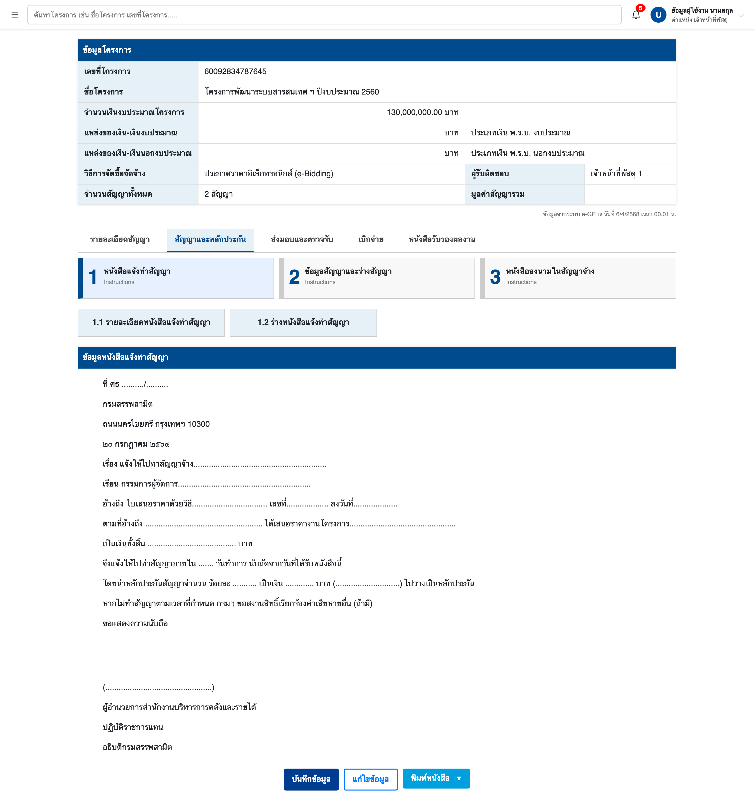

# TestPcc Angular 18

1. Clone project ด้วยคำสั่ง (git clone https://github.com/golfzaza051255/test-pcc.git)
2. Install project ด้วยคำสั่ง (npm install)
3. Run project ด้วยคำสั่ง (ng serve)
 - ตัวอย่าง UI ของระบบ ครับ ตอนนี้กดได้แค่ พิมพ์หนังสือ ครับ
